# Clase 4 - Postman

## Que es Postman?

Postman es una de las herramientas mas populares para probar APIs. Comenzo en 2012 como un side-project, y actualmente se convirtio en uno de los standards para el desarrollo. Es un ADE (API Development Enviroment), el cual permite (entre otras funcionalidades) lo siguiente:

* Mock y Diseño de APIs
* Generacion de documentación sobre una API
* Creación de colecciones de requests
* Testing automatizado de APIs
* Manejo de distintos ambientes

## Instalación

Esta es una herramienta open source gratuita, por lo cual su instalacion es muy simple. Se encuentra disponible para todas las plataformas mas usadas (Windows, MacOS, Linux). Se descarga desde este [link](https://www.getpostman.com/downloads/).

Hacerse una cuenta de Postman es opcional, por lo cual queda a su gusto. Tener una cuenta permite hacer backups de las requests y sincronizar informacion. Sin embargo, tambien se pueden exportar las colecciones de requests de manera facil, lo cual veremos mas adelante. 

Una vez terminada la instalación, veremos la pantalla principal:


## Ejemplo: API a utilizar

Para aprender a usar Postman, utilizaremos una API dummy, la cual no tiene mucha funcionalidad pero nos servira para poder probar facilmente. La API es https://jsonplaceholder.typicode.com/. En su pagina se puede encontrar informacion y sus endpoints.

La url que utilizaremos es https://jsonplaceholder.typicode.com/users, que como su nombre indica, es un placerholder que retorna users random.

## Primer request

Crearemos nuestra primera request. Los pasos que haremos seran los siguientes:

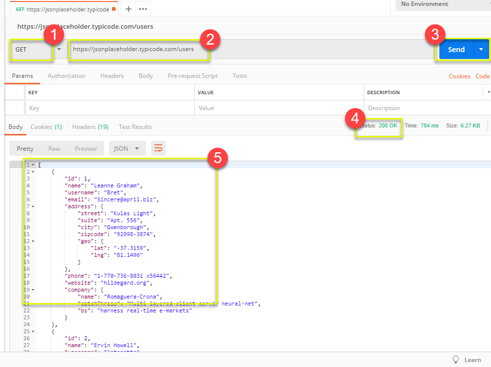

1 - Definimos la request como un GET, presionando en el boton marcado.
2 - Ingresamos la URL previamente mencionada. La request es enviara a la URL que pongamos en este campo
3 - Presionamos send. Esto puede mostrar (o no) un pequeño rato una pantalla indicando que esta cargando
4 - La respuesta llego. Podemos ver el status code donde se marca en la imagen. En este caso es 200, ya que fue exitosa
5 - Debajo vemos la respuesta del servicio

## Primer POST

Ahora creamos nuestro primer POST. La principal diferencia con la anterior sera que estamos enviando datos en esta ocasión.

**1)** Primero, crearemos una tab nueva para hacer otra request sin cambiar la anterior que hicimos:

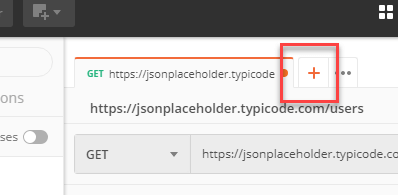

**2)** Segundo, haremos pasos similares a la primer request que hicimos:
* Ingresamos la URL (la misma que antes)
* Seleccionamos el metodo (en este caso, POST)
* Por ultimo, seleccionamos la tab Body. Aqui sera donde ingresaremos los datos que queremos enviar en la request

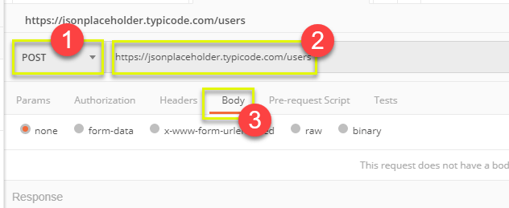

**3)** Tercero, seleccionamos el formato de la informacion a enviar:

* Seleccionamos `raw`, asi ingresamos los datos manualmente.
* Donde dice `text`, presionamos y seleccionamos `JSON`, ya que es el formato que utilizaremos

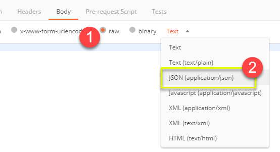

**4)** Cuarto, ingresamos los datos a enviar

La API utilizada recibe un array de users en el post a https://jsonplaceholder.typicode.com/users, Por lo que copiamos y pegamos uno.

```
[
    {
        "id": 11,
        "name": "Krishna Rungta",
        "username": "Bret",
        "email": "Sincere@april.biz",
        "address": {
            "street": "Kulas Light",
            "suite": "Apt. 556",
            "city": "Gwenborough",
            "zipcode": "92998-3874",
            "geo": {
                "lat": "-37.3159",
                "lng": "81.1496"
            }
        },
        "phone": "1-770-736-8031 x56442",
        "website": "hildegard.org",
        "company": {
            "name": "Romaguera-Crona",
            "catchPhrase": "Multi-layered client-server neural-net",
            "bs": "harness real-time e-markets"
        }
    }
]
```

El unico cambio hecho fue que se cambio el `id` a 11, para evitar una colision con uno ya existente.

Luego de presionar `Send`, vemos la respuesta como en la `GET` request hecha previamente.

## Ambientes y parametros

Un enviroment es un conjunto de variables las cuales son un par clave-valor.

Cuando se trabaja con APIs, generalmente se necesitan distintos setups, pudiendo cambiar entre ellos facilmente. Lo primero que se le viene a alguien a la mente es tener variables para produccion (lo que hay usuarios usando), staging (ambiente de pruebas) o servidor local (en mi computadora). Cada uno utiliza valores distintos para las variables.

Imaginense la situacion de tener 100 requests a un dominio `https://a.com` creadas en postman. Un dia, se necesitan hacer estas requests a otra URL ya que cambio el dominio, `https://b.com`. Si no tuvieramos ambientes, habria que ir **una por una** cambiando la url. En cambio, si la URL es un parametro en el enviroment, solo se cambia en un lugar.

### Como usar parametros

Los parametros en una request son usados a traves del uso de llaves dobles: `{{ejemplo}}`.

Por ejemplo: `{{url}}/users` introducira el valor de la variable url del enviroment.

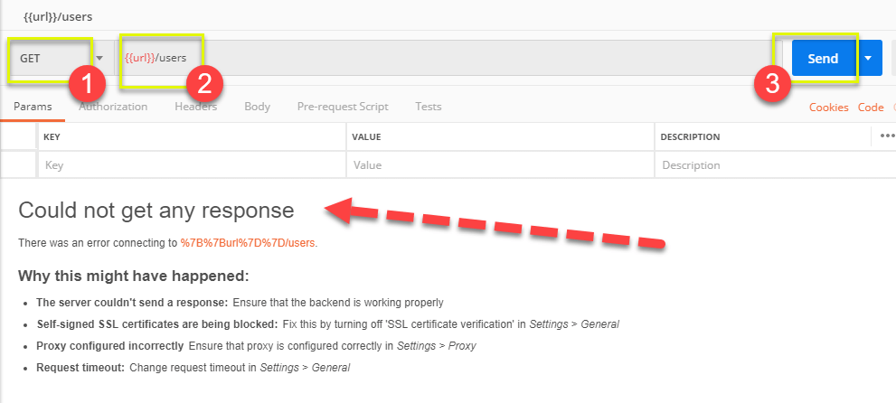

Aca se puede ver como usamos el parametros `{{url}}` para definir la URL de la API. Si presionamos `Send`, la request fallara, ya que no definimos el valor de `url`.

### Creación de las variables

Presionamos el ojo que se encuentra arriba a la derecha. Aqui se presentan dos opciones, `Globals` y `Enviroments`. 
* `Globals` define variables que pueden usar todas las requests, sin importar
* `Enviroments` permite definir variables que solo podran ser accedidas por las requests que utilicen el enviroment.

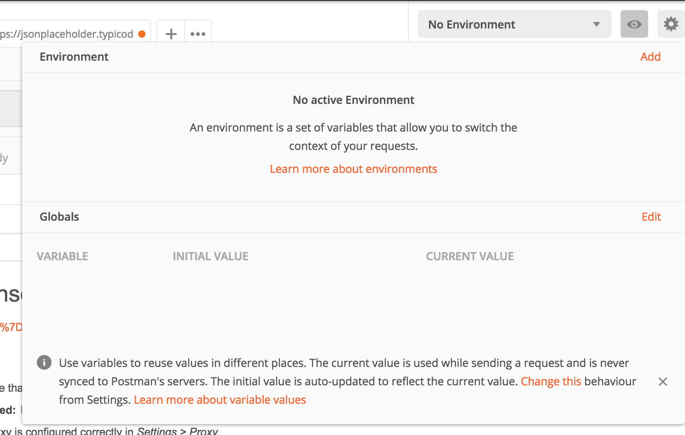

En nuestro caso, usaremos `Globals` por simplicidad.

Presionamos `Edit` en `Globals`, e ingresamos los datos que queremos:

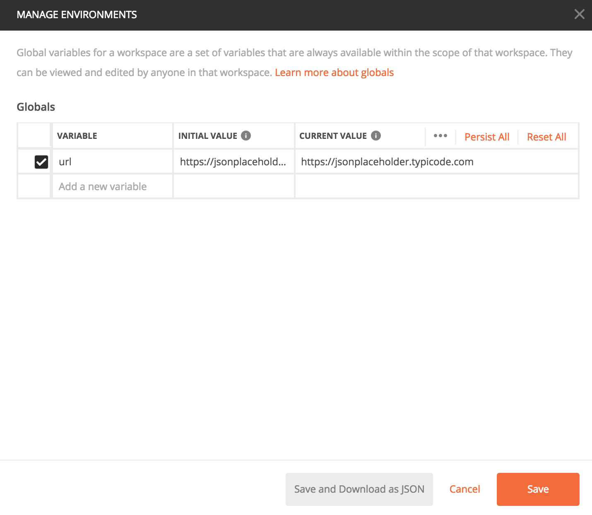

Ingresamos la url base (`https://jsonplaceholder.typicode.com`) y presionamos `Save`.

Si ejecutamos la request de vuelta, vemos como es exitosa:

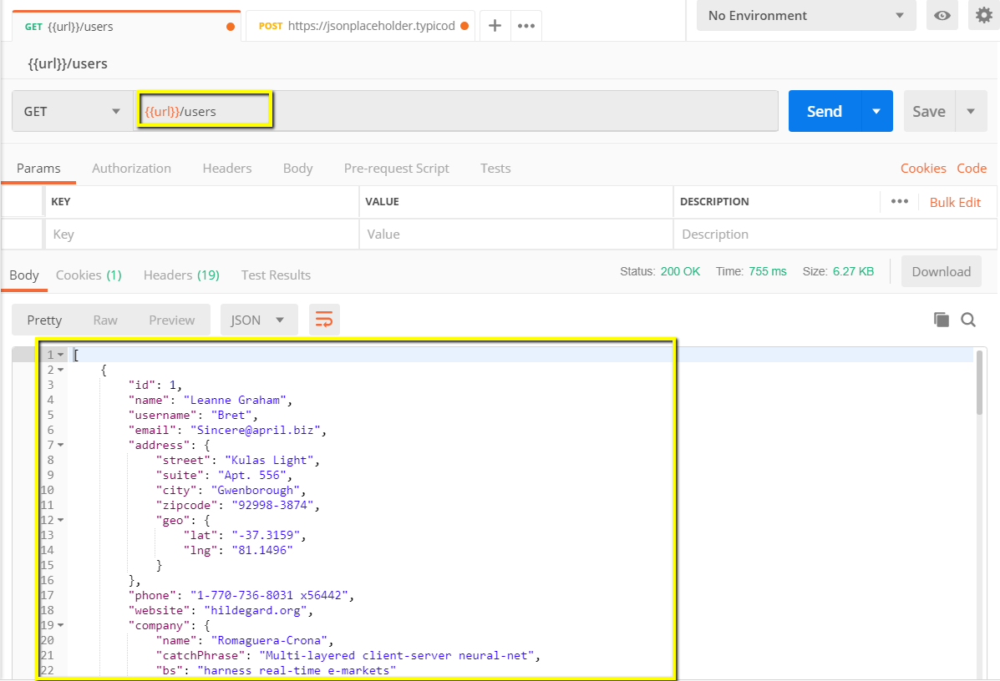

### Variables predefinidas

Postman nos permite usar algunas variables que ya vienen predefinidas, las cuales son de mucha ayuda a la hora de hacer requests:

* `{{$guid}}`: Crea un GUID
* `{{$timestamp}}`: Retorna el timestamp actual
* `{{$randomInt}}`: Retorna un numero random entre 0 y 1000

## Scripts y Testing

Los scripts en Postman son hechos mediante pequeños pedazos de codigo Javascript. Estos permiten varias funcionalidades, pero la principal es realizar tests. Permiten validar varias cosas, como el status code de una request, el contenido retornado por la request, hacer comparaciones entre valores, etc.

Existen dos tipos de scripts:

* **Pre-Request scripts:** Se ejecutan antes que la request sea enviada al servidor
* **Test scripts:** Se ejecutan despues que la response del servidor llega.


### Pre-request scripts

Son utiles para incluir headers, modificar o agregar variables antes de una request. Por ejemplo, se puede setear la fecha actual en una variable

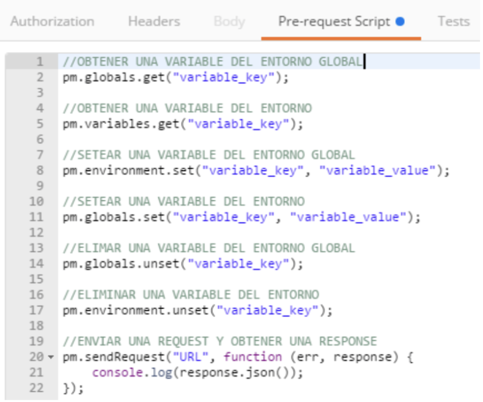

### Test Scripts

Permiten verificar varios aspectos del resultado de una request

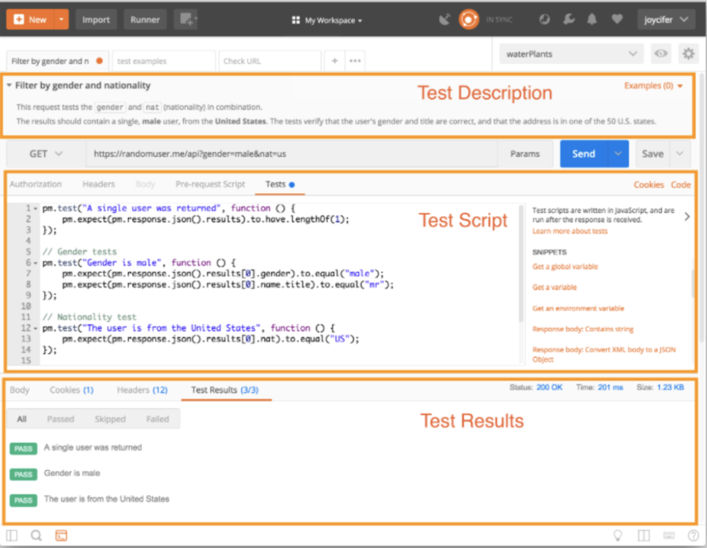

Los tests en postman se crean ejecutando `pm.test(..)`. Estos tests tienen una similitud muy grande con tests realizados con [mocha](https://mochajs.org/) en conjunto con [chai](https://www.chaijs.com/), dos librerias muy utilizadas en el mundo Javascript para testing.

**Algunos snippets interesantes:**

1)

```
pm.response.to.have.status(200);
``` 
Verifica que la respuesta tenga un status code 200

2) 
```
pm.response.to.have.header("Content-Type");
```
Verifica que este presente el header `Content-Type`

3) 

```
var jsonData = pm.response.json(); 
pm.expect(jsonData.status).to.eql("success");
```

Toma el cuerpo de la respuesta y lo guarda en una variable como json (recordamos que es Javascript puro). Verifica que el campo `status` del json sea igual al string `"success"`.

4)

```
var jsonData = pm.response.json();
pm.response.to.have.status(200);
pm.expect(jsonData).does.include("token")
if (pm.response.code === 200 && json.data.token !== null) {
  pm.enviroment.set("token", jsonData.token)
} 
```

Este es un caso avanzado. Checkea que la respuesta tenga codigo 200 e incluya un token dentro del json de la respuesta. Si esto es asi, setea en el enviroment la variable token con el valor. Es sumamente util en situaciones de testing automatizado.

### Documentacion oficial

La especificacion completa de que se pueda hacer se encuenta en la documentacion oficial en este [link](https://www.postmanlabs.com/postman-collection/)

### Ejemplo

Siguiendo con el ejemplo, haremos un par de pruebas sobre la request `GET` que realizamos previamente:

Vamos a la request, y presionamos la tab `tests`. En la seccion de snippets, seleccionamos `Status Code is 200` y vemos como se agrega el test

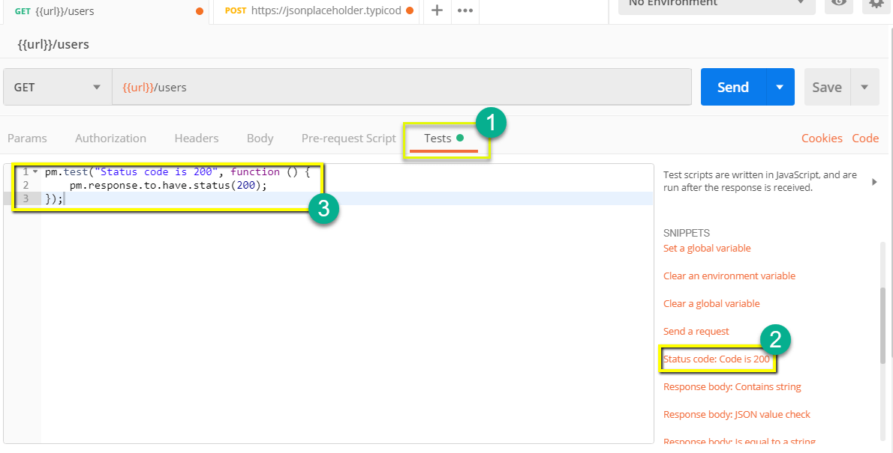

Corremos la request, y vemos que el test es exitoso!


Ahora agregaremos otro test. Dentro de snippets, seleccionamos `Response Body: JSON value check`.

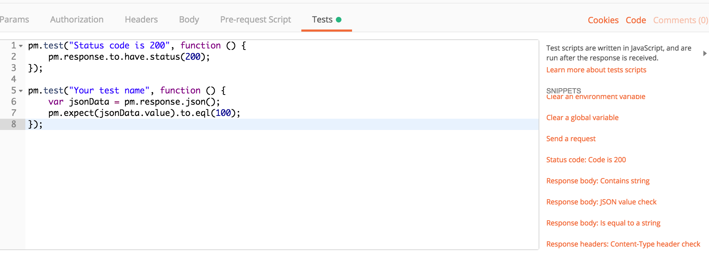

Vamos a modificar este test. Primer modificaremos su nombre, y luego el codigo en si:

```javascript
pm.test("Check if first user is Leanne Graham", function () {
    var jsonData = pm.response.json();
    pm.expect(jsonData[0].name).to.eql("Leanne Graham");
});
```

Cambiamos el nombre a algo mas descriptivo. Lo que hacemos en este test es:

* Obtenemos la respuesta como json
* `jsonData[0]` asume que `jsonData` es un array, y agarra el primer valor. Compara el valor `name` con `"Leanne Graham"`

Enviamos la request con este test, y vemos como los tests pasan!

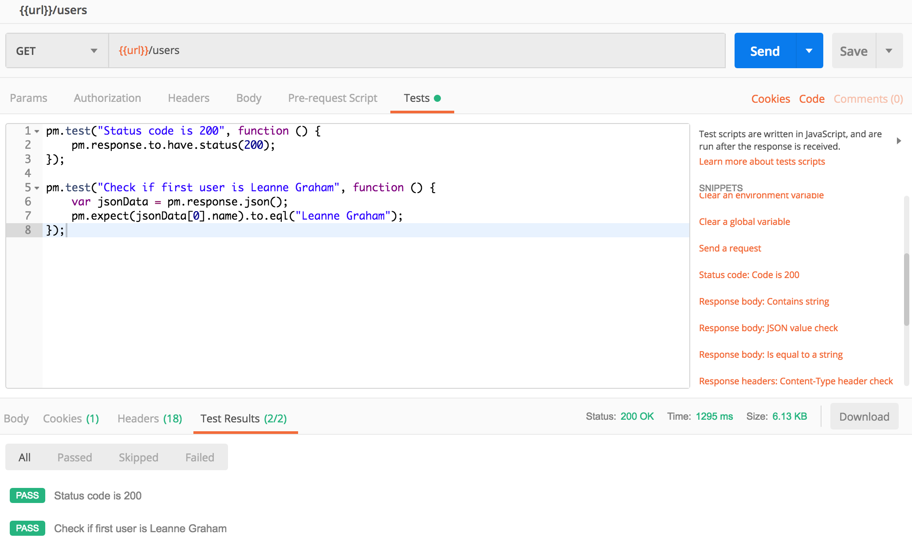

## Collections

Una coleccion de postman es un conjunto de requests individuales que son guardadas en una carpeta con un nombre. Facilitan mucho la organizacion y el export de un conjunto de requests. Tambien permiten ejecutar un conjunto de tests mas facilmente.

Crearemos una collection para los tests que estuvimos creando.

Presionamos donde dice `New` arriba a la izquierda y seleccionamos `Collection
`

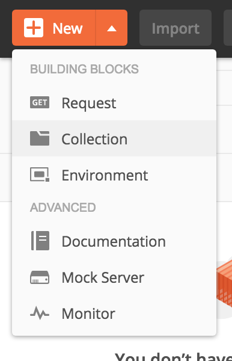

Ingresamos el titulo y la descripcion de la collection que queremos:

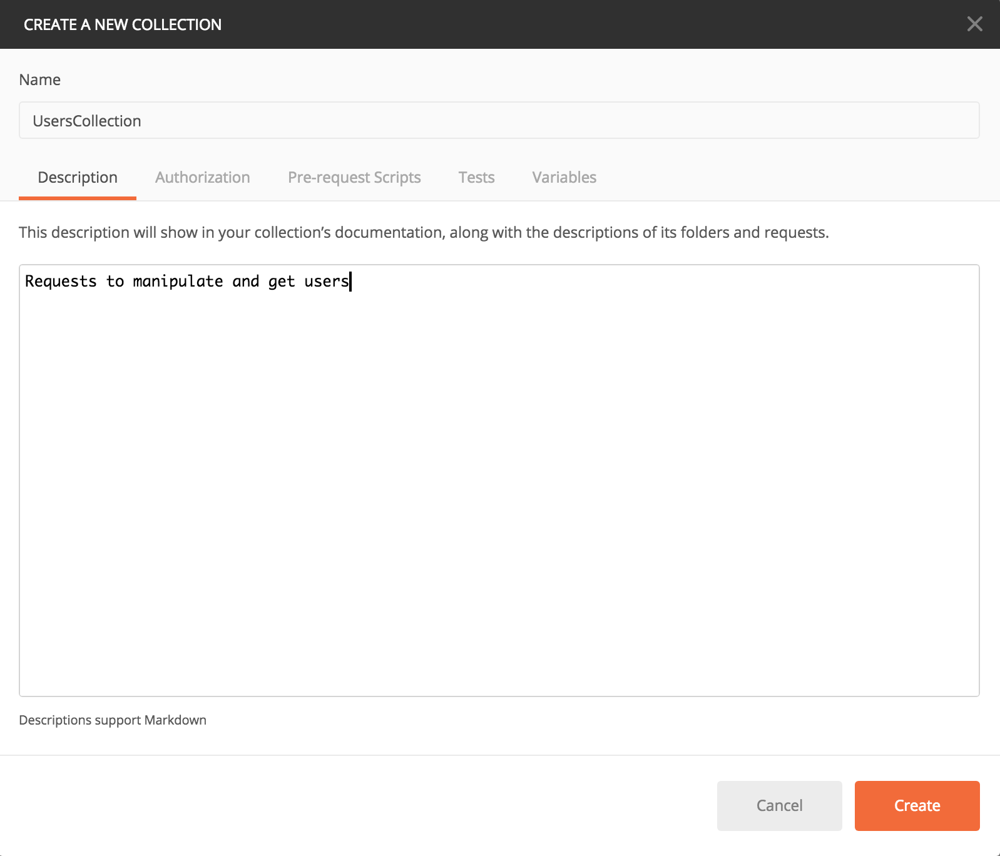

Presionamos save, y vemos como se queda creada a la izquierda.

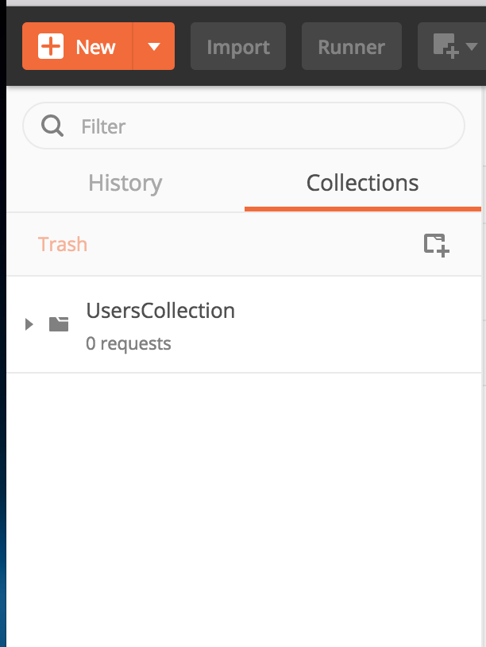

Para guardar una request, vamos a ella y presionamos save arriba a la derecha. Ahi nos deja elegir un nombre para esta request, y agregarla a una collection. Seleccionamos la collection previamente creada.

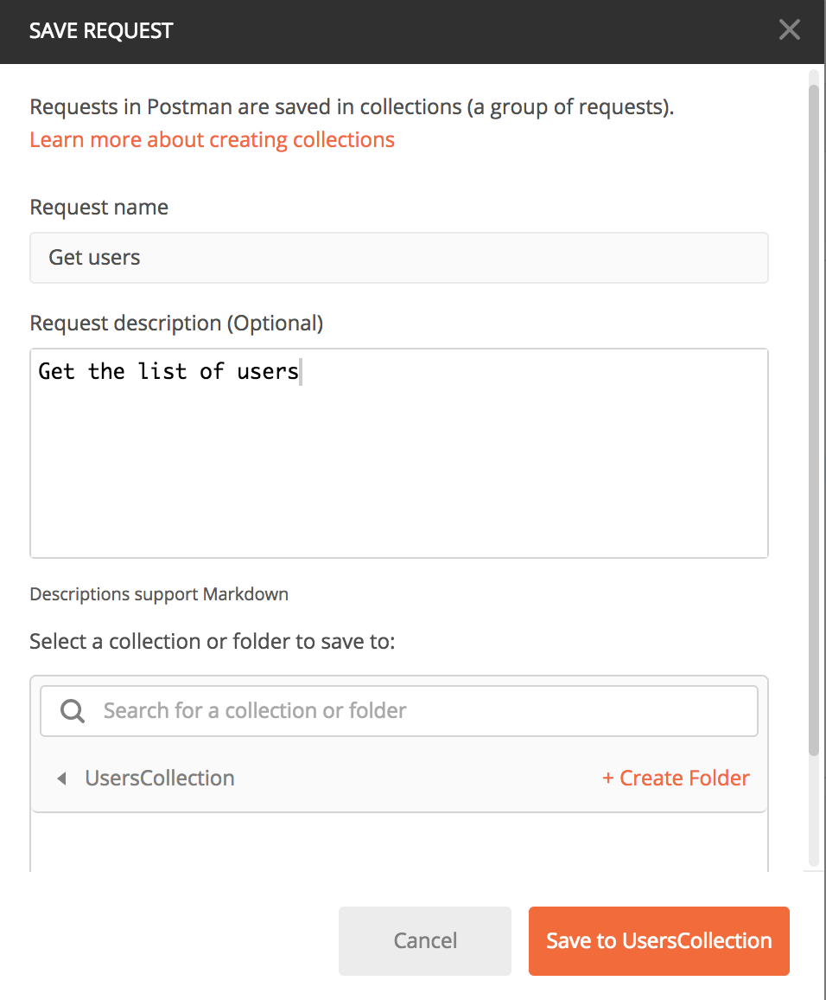

Repetimos el mismo paso para la otra request y tenemos la collection creada.

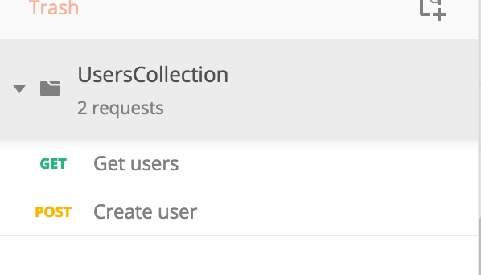

## Testing automático

Se puede correr un conjunto de requests automaticamente y que se ejecuten todos sus tests. Esto se hace mediante las collections. 

Existen varios datos a configurar para correrlas, inclusive el enviroment donde esta corriendo. Veremos todo esto a continuación.

Para correr la collection, vamos a la seccion `Runner` arriba a la izquierda:

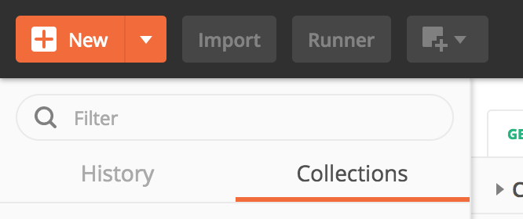

Esto nos abrira una nueva ventana, donde podemos ver varios parametros configurables a la izquierda, y las corridas de los tests a la derecha. Existen muchas variables a configurar, que recomendamos que investiguen ya que pueden ser utiles.

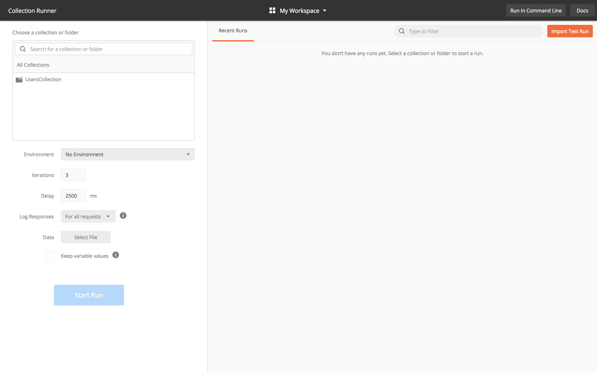

Configuraremos algunas de las variables. En este caso 3 iteraciones, para que se ejecute cada request 3 veces, y un delay de 2500ms para que no sean tan seguidas. Por ultimo, seleccionamos la collection que creamos previamente y seleccionamos `Run`.

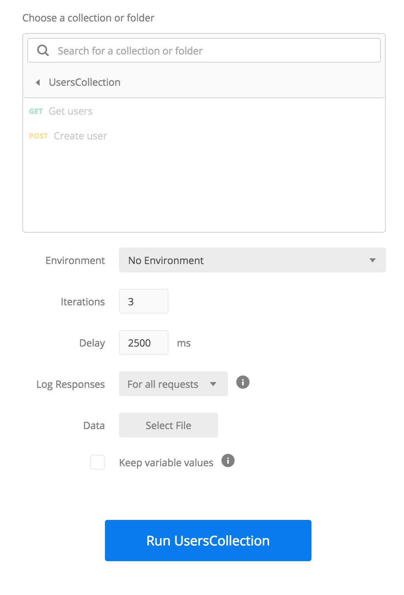

Vemos como se empiezan a ejecutar, y luego de finalizado vemos los resultados. Todos los tests pasaron en este caso.

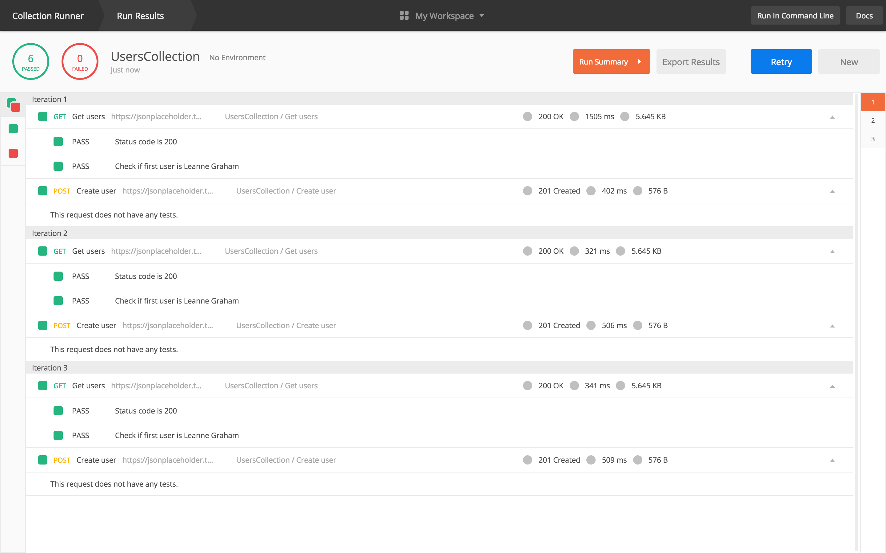

## Mas información detallada y fuente de las imagenes

[Postman tutorial](https://www.guru99.com/postman-tutorial.html)
