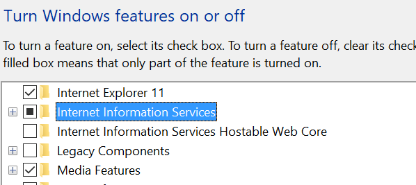
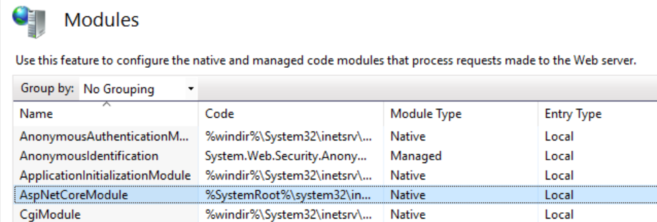
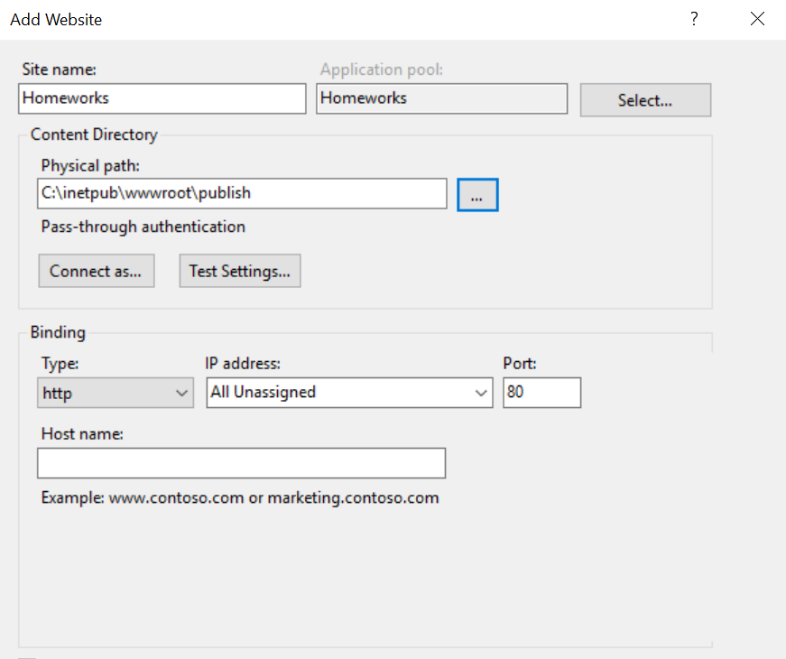
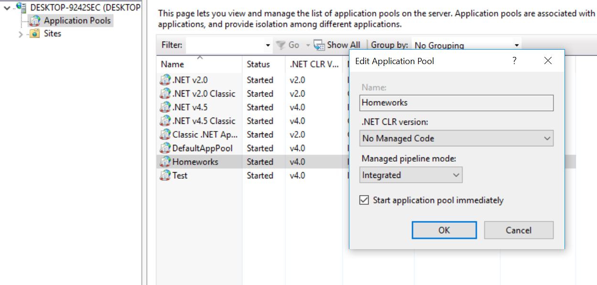
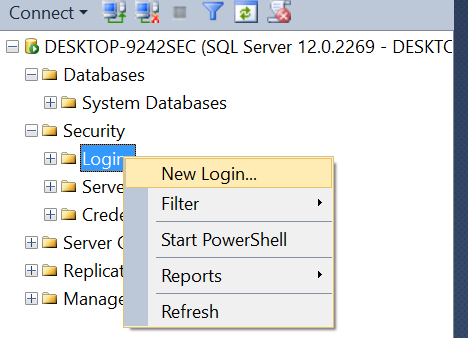
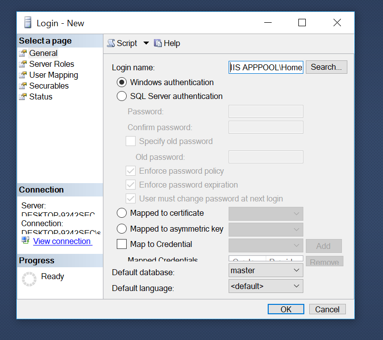
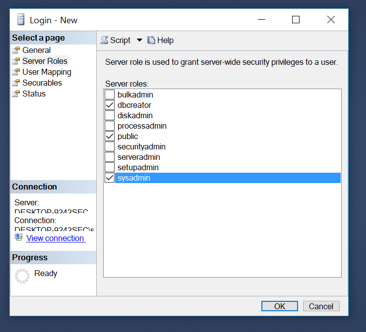

# Deployment En IIS

**Pasos para desplegar su proyecto de ASP.NET Web Api en IIS:**

1) Realizar el deploy de la webapi. Para esto debemos pararnos en el proyecto `WebApi` y lanzar el siguiente comando `dotnet publish -c Release`, ahora nuestro release se encuentra dentro de nuestro proyecto de webapi en la carpeta bin/Release/netcoreapp2.X y es la carpeta llamada publish.

2) Asegurarse que el servicio de SQL Server este iniciado. Ver el nombre del servidor de SQL Server y agregarlo al 
connectionstring del **appsettings.json** de nuestra web api.

3) Antes de hacer el deployment, debo asegurarme de tener instalado IIS.

**Vamos a:**

Panel de control\Todos los elementos de Panel de control\Programas y características



Y alli, elegimos: "Activar o desactivar caracteristicas de Windows". Alli dentro, tickear la opcion Internet Information Services y todo su interior. 

4) Copiamos el proyecto (carpeta publish) y lo pegamos en C:\inetpub\wwwroot.

5) Abrimos el Administrador de Internet Information Services (IIS). Esto llegamos haciendo run de "inetmgr" o buscando en Windows.



Ahora vamos a Modulos y nos fijamos si tenemos instalado el modulo "AspNetCoreModule" si no es el caso vamos [aqui](https://www.microsoft.com/net/download) y descargamos **.NET Core Runtime**



Agregar un nuevo Sitio. Para ello se hace click derecho sobre “Sitios” y se Agrega un Nuevo sitio. Se le pone un nuevo nombre, se elige la ruta física del proyecto de la Web Api  que acabamos de copiar y luego se elige el puerto 8080, 12345, o alguno que no esté en uso.



6) Ahora vamos a Application Pools (encima de Sitios) y buscamos el pool que le asignamos al sitio (por lo general el nombre de este) y hacemos clic en este en .NET CLR Version selecionamos No Managed Code aceptamos y listo



7) Abrir SQL Server Management Studio. En nuestra instancia de la BD, buscamos la pestaña Servidor/Inicios de Sesión. Click derecho y le damos ‘Nuevo Inicio de Sesión’.



8) Como nombre de inicio de sesión agregamos: IIS APPPOOL\Nombre_de_nuestro_sitio_en_IIS. Luego damos Aceptar.

9) Vemos que se agregó un nuevo Inicio de Sesión. Le damos click derecho/propiedades.



10) En roles del servidor, elegimos dbcreator/public/sysadmin y damos aceptar.

## Solucionando problema: 405 methods not allowed PUT/DELETE

Para eso hay que agregar el siguiente codigo en nuestro web.config

```
<system.webServer>
  <modules runAllManagedModulesForAllRequests="false">
    <remove name="WebDAVModule" />
  </modules>
</system.webServer>
```
Quedando de esta manera:

```
<?xml version="1.0" encoding="utf-8"?>
<configuration>
  <location path="." inheritInChildApplications="false">>
    <system.webServer>
      <modules runAllManagedModulesForAllRequests="false">
        <remove name="WebDAVModule" />
      </modules>
      <handlers>
        <add name="aspNetCore" path="*" verb="*" modules="AspNetCoreModule" resourceType="Unspecified" />
      </handlers>
      <aspNetCore processPath="dotnet" arguments=".\Homeworks.WebApi.dll" stdoutLogEnabled="false" stdoutLogFile=".\logs\stdout" />
    </system.webServer>
  </location>
</configuration>
<!--ProjectGuid: 77a33815-ea40-4a42-a558-b4357066c184-->
```
## Mas Info

* [WebADV](https://www.ryadel.com/en/error-405-methods-not-allowed-asp-net-core-put-delete-requests/)
* [Aulas Guia](https://aulas.ort.edu.uy/pluginfile.php/327939/mod_resource/content/1/Deploy%20Ob1.pdf)
